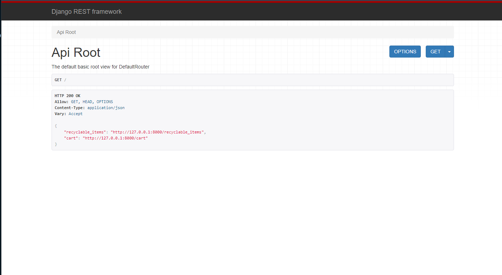

# Project Setup Instructions for first time installation

Follow these steps to set up and run the project:

1. Install the required packages using Pipenv:
    ```sh
    pipenv install
    ```

2. Activate the virtual environment:
    ```sh
    pipenv shell
    ```

3. Create the database migrations:
    ```sh
    python manage.py makemigrations
    ```

4. Apply the migrations to the database:
    ```sh
    python manage.py migrate
    ```

5. Start the development server:
    ```sh
    python manage.py runserver
    ```


## HOW TO START THE SERVER FOR FRONT-END
1. Open Terminal:
    ```sh
    pipenv shell
    ```

2. Start Python Interpreter:
    ```sh
    CTRL + Shift + P and click Python: Select Interpriter
    ```    

3. Select the correct Python Interpreter:
    ```sh
    Python (version)(`file_name_server_randomString`:Pipenv) ~.\virtualenvs\sec...
    ```  

4. Open Terminal to Start Server:
    ```sh
    python manage.py runserver
    ```       

5. Verify server is running by clicking to open web page to see data:
    ```sh
    Starting development server at http://127.0.0.1:8000/
    ```
   


## TO LOAD FIXTURES 
1. Create the database migrations:
    ```sh
    python manage.py makemigrations
    ```

2. Apply the migrations to the database:
    ```sh
    python manage.py migrate
    ```

3. Load each fixtures into the database:
    ```sh
    python manage.py loaddata fixture_file_name.json
    ```

4. Verify the fixtures were loaded correctly:
    ``` sh
    CTRL + SHIFT + P to open SQllite: 
    Database and verify the data is in the explorer 
    click file_name_item_name
    click play to the right of item name
    ```

## TO TEST ENDPOINTS
1. Ensure that your .env file has the following items in it:
    ```sh
    NEXT_PUBLIC_FIREBASE_API_KEY=""
    NEXT_PUBLIC_FIREBASE_AUTH_DOMAIN=""
    NEXT_PUBLIC_DATABASE_URL="http://127.0.0.1:8000/"
    ```

2. At the top of your API page:
    ```sh
    const endpoint = process.env.NEXT_PUBLIC_DATABASE_URL;
    ```

3. Promise fetch call shold look like this:
    ```sh
    fetch(`${endpoint}recyclable_items`, {
    ```        